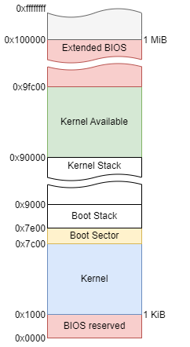

# Booting

## Preliminaries

Before booting the OS, the Basic Input/Output System (BIOS) does a lot of stuff to prepare.
The actual workings of the BIOS differ from motherboard to motherboard, but they share common interfaces that we can use. These interfaces are accessed similarly to how you would access them on a 32-bit x86 Linux system, via the `int` instruction.
The BIOS does a lot of work behind the scenes. It creates and maintains the Interrupt Vector Table (IVT) and can interface with hardware – most importantly, the disk.
Finally, we get to the OS, BIOS will load the first sector (512-bytes) of the disk into main memory at 0x7c00 for us (as long as we say the magic word)!

## Boot Sector

The boot sector (see [boot_sect.asm](../../src/boot/boot_sect.asm)) is the very first code that we write that gets executed. It is important to keep in mind at this point we only have 512-bytes of code/data loaded, which is not much. In addition we also need the "magic word" 0xaa55 as the last word in the sector to signify that this is a bootable sector. `times 509 - ($ - $$) db 0` is a neat assembly trick that gets our binary to exactly 512-bytes.
You may have noticed `[bits 16]` in the assembly, this is because BIOS starts us out in "real mode" which is fancy for 16-bit. Real mode uses segmentation heavily, but discussing segmentation is outside of the scope of this document since we don't have to deal with it.
First we store the boot drive in a defined place in memory. BIOS puts the boot drive in `dl` on boot. Next we set the stack to be at 0x9000 (`bp` and `sp` are the 16-bit stack registers). Our next step is to load the rest of the kernel. BIOS uses Cylinder Head Sector (CHS) addressing for disk access, here are some important details:

- A sector is a 512-byte section that is indexed from 1.
- A cylinder is a ring on a platter that is indexed from 0.
- A head is the physical reader that is also indexed from 0.

Since we want the second sector (first is the boot sector) onwards, we only need the very first cylinder and head. Now we want to tell the BIOS to execute a read operation.
We move `2` into `ah` to signify we want to read. Then `42` into `al` to signify we want to read 42 sectors (512 * 42 = 21504-bytes). Then `cl` gets 2 for the sector, `ch` and `dh` get 0 for cylinder and head respectively. Then `OS_OFFSET` (0x1000) is put in `bx`, this tells BIOS where we want the result of our read to be stored in memory. Finally, we do `int 0x13` which is the disk interrupt for BIOS.  
Now that we have the OS loaded, we need to get into 32-bit mode (also known as protected mode, long mode is 64-bit). Now we switch over to [enter_pm.asm](../../src/boot/enter_pm.asm) and [gdt.asm](../../src/boot/gdt.asm).  

### Protected Mode

Protected (32-bit) mode is our main mode of operation. Something to note is that we cannot interact with BIOS outside of real (16-bit) mode. So we start by disabling interrupts, since we don't want BIOS interfering with the switch. Next, we load the Global Descriptor Table (GDT), which was brought in with our boot sector. The GDT allows us to protect our data, but we won't use the GDT for that functionality. We have 3 entries in our table, each 8-bytes long. The first entry is just zeros. Next we have our code segment, which we have as spanning as large as it can, offset by 0, and it is executable. The data segment is the same except it is marked read/write. Our GDT descriptor describes the size (in bytes) of our GDT and the address of it in memory. We finalize all this via `lgdt` which loads the GDT.  

Now we need to set the first bit of control register 0 (`cr0`), which tells the cpu we want to enable protected mode. Finally we do a "far jump" to init_pm. A far jump is a jump that changes segment, this is the only segmentation we will ever do manually. Now we are in 32-bit protected mode! The only thing left is to set the segment registers to our data segment and move the stack. We move the stack to 0x90000 since that is the top of our free space, and it's a large open area.

### Entry

Now is the time to open [os_entry.asm](../../src/boot/os_entry.asm). Our only remaining task is calling OS_OFFSET (0x1000), which is where we loaded our kernel earlier. This should not return but if it does we execute `hlt`. Keep in mind interrupts are still off at this point. Now we have officially entered the world of C and left the world of booting and assembly. We call os_main and that puts us in C.  

#### Notes

Since we only load `42` sectors, if our kernel grows larger this will have to change. The first thing we would notice is things like strings being messed up or missing. Then after that comes static data being missing. The Final thing to go is code itself, which would be very tough to diagnose.

#### Important Addresses
  
- `0x1000`: location of the kernel.  
- `0x7c00`: location of boot sector.
- `0x9000`: location of stack at boot.
- `0x90000`: location of stack at kernel entry.

#### Further Reading

[BIOS](https://wiki.osdev.org/BIOS)  
[GDT](https://wiki.osdev.org/Global_Descriptor_Table)  
[Bootloader Guide](https://wiki.osdev.org/Rolling_Your_Own_Bootloader)  
[BIOS int 0x13](https://wiki.osdev.org/Disk_access_using_the_BIOS_(INT_13h))
