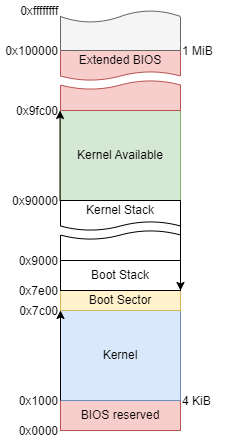

# Detecting Memory

## Preliminaries

Memory in x86 is standardized up to 1MB. Past that, other BIOS processes use
chunks of memory in unpredictable locations. To maximize the amount 
of useable memory in our system, we need to query the BIOS.

## Detecting Memory

"Low Memory" is memory below 1MB. BIOS has a couple of functions to detect
these addresses, as a contiguous block, but is limited in the amount of
memory we are able to get, so we choose to omit it entirely.

"Upper Memory" is memory above 1MB, typically up to just below 4GB. While
memory detection can move past that in 64-bit systems, this amount is
sufficient for our use cases. The BIOS function used to detect upper memory
across most devices is `int 0x15 EAX=0xe820`. Each call to this function
stores a structure in memory that looks as follows:

```
struct memChunk {
    uint64_t base; // base addr of mem. chunk
    uint64_t len; // len of mem. chunk
    uint32_t type; // what mem. chunk is used for
}
```

From there, our program builds an array of these structures in memory,
for use later in our operating system. A dynamic allocator can read this 
array after we transition to 32-bit mode to build a dynamic allocator.

#### Important Addresses
  
- `0x1000`: location of the kernel.  
- `0x7c00`: location of boot sector.
- `0x9000`: location of stack at boot.
- `0x90000`: location of stack at kernel entry.



#### Further Reading

[BIOS](https://wiki.osdev.org/BIOS)  
[GDT](https://wiki.osdev.org/Global_Descriptor_Table)  
[Bootloader Guide](https://wiki.osdev.org/Rolling_Your_Own_Bootloader)  
[BIOS int 0x13](https://wiki.osdev.org/Disk_access_using_the_BIOS_(INT_13h))
