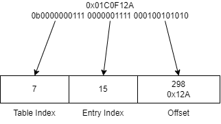

# Paging

## MMU and You

The Memory Management Unit (MMU) is responsible for translating "virtual" addresses to "physical" addresses. A "physical" address is an address that maps directly to a system's memory. On the other hand, a "virtual" address is an address that indirectly maps to a system's memory. When addresses are identity mapped, a virtual address is equivalent to a physical address (in that context).
  
The MMU will always translate addresses once it is enabled (via `cr0`). However, this creates overhead for one of the most frequent operations. To minimize this overhead, the MMU maintains a cache referred to as the Translation Lookaside Buffer (TLB). Since the TLB doesn't constantly monitor if the translation tables are modified, it must be invalidated whenever a change is made. This takes the form of either `mov eax, cr3; mov cr3, eax` or `invlpg eax`. The first essentially sets the active translation context to itself, while `invlpg` is a dedicated instruction for invalidating just 1 page (although it may invalidate more).

## Page Directory

A Page Directory is a translation context. There can be many, and multiprocess operating systems may give each process its own page directory. However, only one is active at a time, the address of which can be found in `cr3`. The structure itself is 4KiB and consists of 1024 4-byte entries (for 32-bit x86). Each entry consists of 20-bits of address pointing to a page aligned Page Table, several flags, and some available bits. The important flags are Present, Accessed, Cache Disable, Write Through, Read/Write, User/Supervisor.

- Present signifies that the table exists, if this is false, when the MMU tries to access this entry it will cause a page fault.
- Accessed is set to 1 whenever the MMU accesses that entry, this value should be reset by the OS if the OS intends to use it.
- Cache Disable, as the name implies, prevents the entry from being cached into the TLB.
- Write Through is when data is written to both cache and main memory at the same time, when this flag is 0 write back is used instead. Write back is when cache is used until the cache is invalidated where it then writes to main memory.
- Read/Write and User/Supervisor are permission flags that control who and what is allowed to interact with certain pages.

## Page Table

A Page Table is what determines which physical address is mapped to a virtual address. There are 1024 per page directory, and similarly the structure itself is 4KiB. The structure MUST be page aligned (since the page directory only stores the top 20-bits). The structure consists of 1024 4-byte entries (for 32-bit x86). Each entry consists of 20-bits of address pointing to a 4KiB page in physical memory, several flags, and some available bits. The important flags are the same as the Page Directory, with the addition of the Dirty bit. The dirty bit is set whenever the page is written to, the OS should reset this bit if it wishes to use it.

### Virtual Address Decomposition

A virtual address is comprised of 3 parts, a table index, a entry index, and an offset. The table and entry indexes are 10-bits giving them a range of [0, 1024). The offset is 12-bits, which is [0, 4096).

The following diagram shows a decomposition. The construction of a physical address requires having a page directory populated with tables.

### Mappings

(In the context of a single directory)
  
Identity mapping is when virtual addresses are the same as physical addresses.
  
1:1 mapping is when each virtual address maps uniquely to a physical address. Identity mapping is a 1:1 mapping.
  
N:1 mapping is when multiple virtual addresses map to a phsyical address.
  
1:N mapping can only occur with multiple directories.

#### Further Reading

[Paging](https://wiki.osdev.org/Paging)  
[Page Tables](https://wiki.osdev.org/Page_Tables)  
[Identity Paging](https://wiki.osdev.org/Identity_Paging)  
[MMU](https://wiki.osdev.org/Memory_Management_Unit)  
[TLB](https://wiki.osdev.org/TLB)  
[invlpg](https://www.felixcloutier.com/x86/invlpg)  
